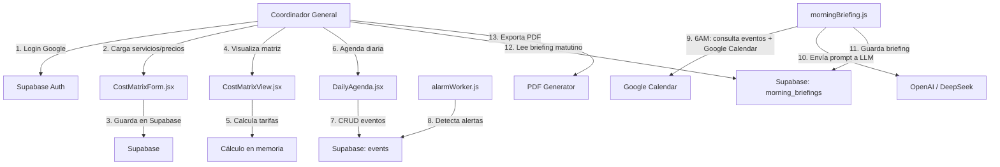

# Arquitectura — Integra Mutual

## Propósito
Describir la arquitectura lógica, flujos y estructura de datos de Integra.

## Componentes principales
- Frontend: Next.js + React + Tailwind CSS
- Backend: Next.js API routes (App Router)
- Base de datos: Supabase PostgreSQL + pgvector
- Autenticación: Google OAuth (Supabase Auth)
- IA: OpenAI / DeepSeek API (reportes matutinos)
- Calendar: Google Calendar API (agenda del Coordinador)
- Seguridad: Gateway PSAI v1.3

## Diagrama de flujo principal

## Flujo de la matriz de costos
1. El Coordinador carga servicios y precios base (Integra 90).
2. El sistema almacena en `service_base_prices`.
3. Al abrir `CostMatrixView.jsx`, se calculan en memoria:
   - `Activo` = base - 60%
   - `Integra 90` = base (0%)
   - `Integra 180` = base - 30%
   - `Integra 360` = base - 40%
   - `Integra 360 Plus` = "A confirmar"
4. La edición de precios requiere autenticación biométrica.

## Estructura de datos (ver `spec/DATA_MODEL.md`)
- `service_groups` — categorías de servicios
- `services` — servicios individuales
- `service_base_prices` — precio base (Integra 90)
- `partner_discounts` — % de descuento por tipo de socio
- `events` — agenda diaria
- `morning_briefings` — reportes matutinos
- `mutual_context` — documentos con embeddings
- `audit_logs` — registro de cambios sensibles

## Seguridad
Ver `SECURITY.md` y `PROTOCOLOS/PSAI_v1.3.md`.
